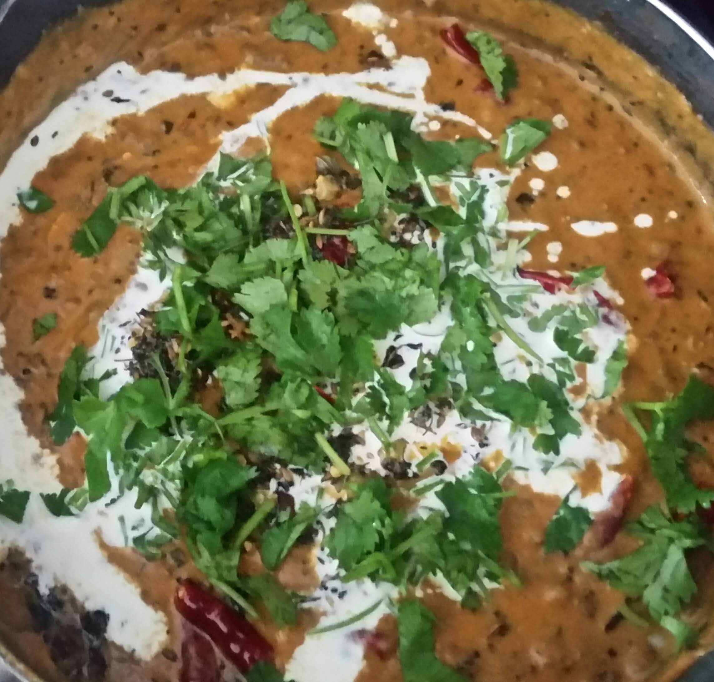

Whole moong dal or mung bean or green gram is a very healthy, high protein gram widely used in Indian cooking. My grandmother makes it quite often and we enjoy it with hot steaming rice.

One day, I thought to give the Moong tadka a creamy twist and it was appreciated by everyone. Malai Moong Tadka is a creamy, delicious curry with aromatic spices. 

###Ingredients
*Main ingredient*
- 1 cup whole moong dal
- 1 onion medium, diced 
- 2 tomatoes medium, diced
- 1/4 to 1/3 cup low fat cream
- 1 or 2 green chillies
- 1/2 inch ginger
- 1 large garlic clove

*Garnishing*

**Serves:** 4\
**Cooking Time:** 30 to 45 minutes

