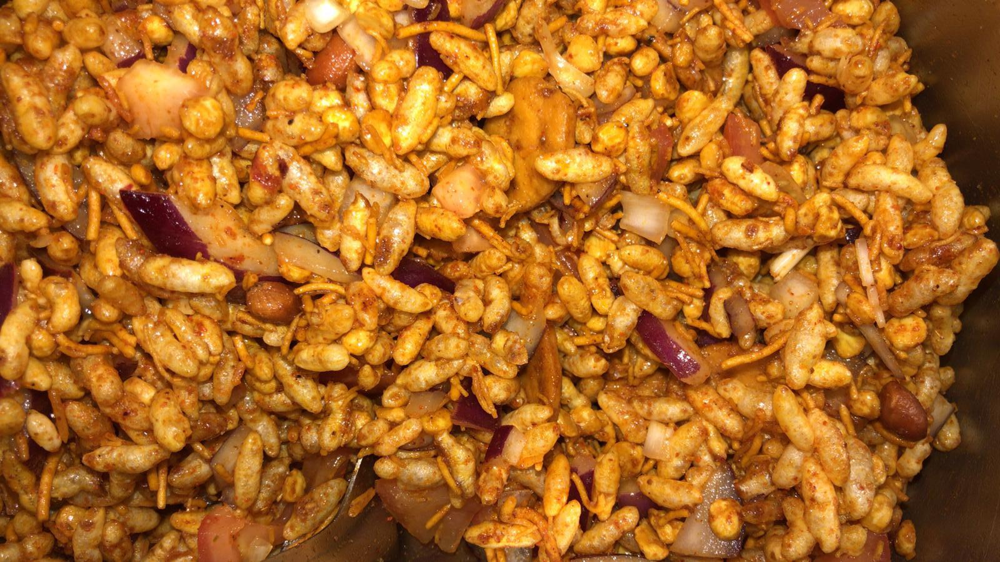

 
One of the popular Indian street food is bhel puri. It's a quick and easy to make dish with tangy, spicy and sweet elements to it. The main ingredient is puffed rice.

**Serves:** 4\
**Cooking Time:** 20 to 30 minutes

###Ingredients
- 2 cups puffed rice
- 1 large boiled potato, chopped in small cubes
- 1 large onion, finely chopped
- 2 medium tomatoes, finely chopped
- 1/4 cup tamarind (reduce the quantity if it is concentrated)
- 1/2 tbsp sugar
- 1/2 tsp green chillies
- 4 tbsp mint leaves
- 1/2 red chilly powder
- 1/4 tsp black salt
- 1/4 tsp cumin seed powder (if not available, dry roast cumin seeds and blend in a fine powder)
- salt to taste
- 1/4 cup peanuts (optional)
- <a href="https://en.wikipedia.org/wiki/Sev_(food)" target="_blank"> 1/4 cup sev </a> (optional)
- 1/4 cup papadi, a crispy fried dough wafers (I couldn't find a link, optional)

###Procedure
*Adjust the below sauces according to your spicy, sweet and tangy flavour preference.*

*Spicy Green Sauce*
- Blend mint, green chillies with 5 tbsp water.

*Sweet Tangy Sauce*
- Soak tamarind in 1/2 cup hot water for 5 to 10 minutes. 
- Using a strainer, squeeze out the juice from tamarind and keep the juice aside. 
- If you are using concentrated tamarind paste, add 8 tbsp water to 4 tbsp tamarind paste. Keep the juice aside. 
- Mix sugar well to the paste.

*Final mixing*
- In a bowl, add finely chopped onions, tomatoes and potatoes. 
- Add red chilly powder, black salt, cumin seed powder and salt to taste. 
- Add the prepared sauces to it. 
- The following steps should be done, when you are ready to serve to ensure bhel puri is still crispy. 
- Add the puffed rice to onion, tomatoes and potatoes mix. 
- Garnish with peanuts, sev, papadi.

Bhel Puri is ready to be served. Garnish with finely chopped fresh coarinder if available.