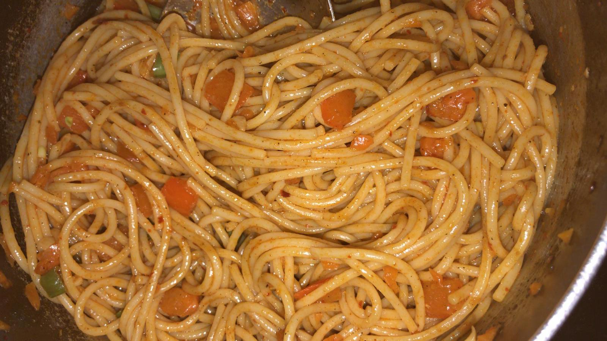

 
Spaghetti stir fried in homemade spicy chilly garlic sauce, this recipe is perfect for lunch and dinner. You can also cook this recipe with vegetables of your choice, noodles or rice. Also, you can adjust the spice as you prefer.

**Serves:** 4\
**Cooking Time:** 20 to 30 minutes

###Ingredients
- 400g spaghetti
- 2 dry red chillies
- 1/2 tsp corn flour
- 2 large garlics, one finely chopped
- 2 tsp oil
- 1/2 tsp soya sauce
- 1/2 cup carrot, chopped
- 1/2 cup beans, chopped
- 1/2 tsp chilly flakes
- 1/2 tsp grounded black pepper
- salt to taste

###Procedure
*Spaghetti*
- In a pan, add water, 1/2 oil and a pinch of salt. Once the water has boiled, add the spaghetti to it. 
- Cook the spaghetti till they are 90% done and rinse them in running water. Rinsing them in running water ensures that there is no further cooking by self heat of spaghetti. 

*Chilly garlic sauce*
- Blend dry red chillies, corn flour, one garlic with 4 table spoons of water. 
- The sauce is ready, keep it aside. 
- You can increase the quantity of ingredients to make more sauce. However, the sauce is best when it is fresh. 

*Stir fry*
- In a pan, add 1.5 tsp oil.
- Once the oil has heated, add the chilly flakes and grounded black pepper to it. Cook for 1 to 2 minutes. 
- Add the carrots, beans or vegetables of your choice. 
- Add salt to taste at this stage to speed up the cooking process. 
- Once the carrots and beans are cooked but are still a bit crunchy and not soft. Add soya sauce and prepared chilly garlic sauce to it.
- Cook for 2 to 3 minutes. 
- Add the cooked and rinsed spaghetti to it. Cook for 3 to 5 minutes. 

Chilly Garlic Spaghetti is ready to be served. You can garnish it with fried garlics or coarinder or some spring onion greens. 