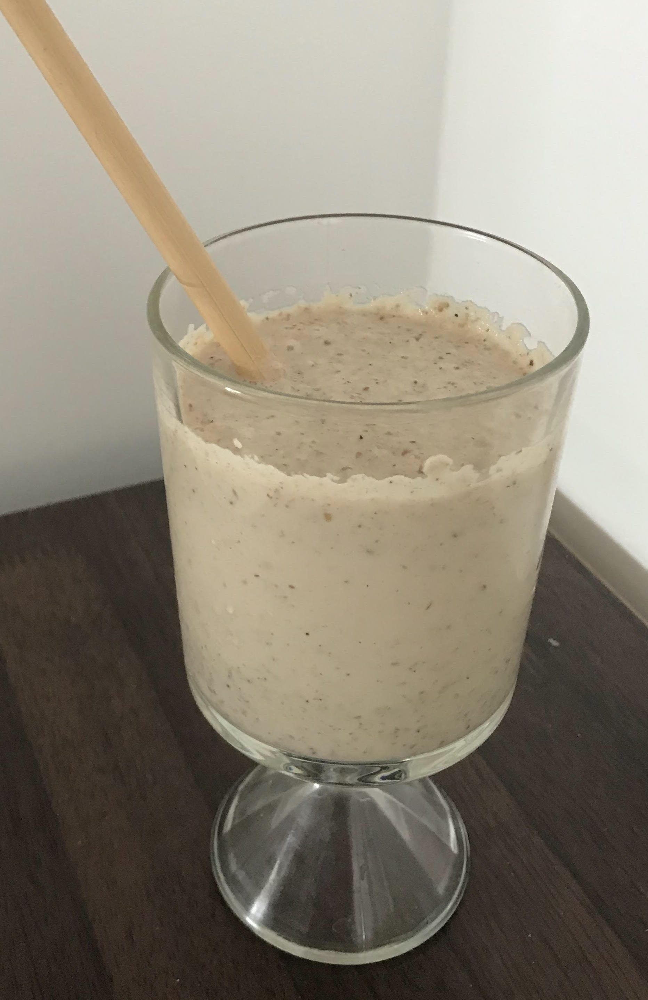

 
I am not a big fan of porridge and always looking for new ways to make oats interesting. This is a quick, healthy and tasty drink to energise your mornings. 

**Serves:** 1\
**Cooking Time:** 10 to 15 minutes

###Ingredients
- 1 medium-sized red apple
- 1 small green cardamom
- 1 medium-sized date
- 1 tsp rose water (If you are using concentrated rose essence, two to three drops should be enough. )
- 1/4th cup oats
- 1/2 cup milk. ( I have used dairy milk. However, feel free to use any milk you like. )

###Procedure
- Take a sauce pan and dry roast the oats until light brown for 2 to 3 minutes.
- Dice the apple and date in medium size and blend them in a fine paste with the cardamom. 
- Add the roasted oats, milk and rose water to the paste and blend once again. 
- Your oats apple drink is ready. Enjoy. 

